# SUSTech_CS207_2021_fall_proj
 Get full marks(120/120).

Work with @[gfzum](https://github.com/gfzum) and @[Soupyf](https://github.com/Soupyf)

 ## 一、开发计划

#### 1、小组选题

停车场收费系统

#### 2、成员分工

- Ljfanny：贡献占比34%，负责项目基础框架、滚动显示模块、会员模块、管理员模块等

- Soupyf：贡献占比33%，负责支付模块、其它模块协助等

- gfzum：贡献占比33%，负责停车模块、标识码验证模块、其它模块协助等

#### 3、进度安排及执行记录

- 11月初：确定选题

- 11月末：完成状态流程图，搭建项目基础框架，开始按模块分工

- 12.1（周三）：滚动显示模块基本完成

- 12.3（周五）：第一次整合讨论，交流情况后进一步细化分工

- 12.10（周五）：第二次整合讨论，停车及标识码模块初步成型，并在随后的周末及后一周进行了多次共同讨论

- 12.20（周一）：基本完成模块串联，开始细节debug和报告撰写

- 12.23（周四）：答辩！

  

## 二、设计

### 0、整体设计

#### 0.0 状态流程图

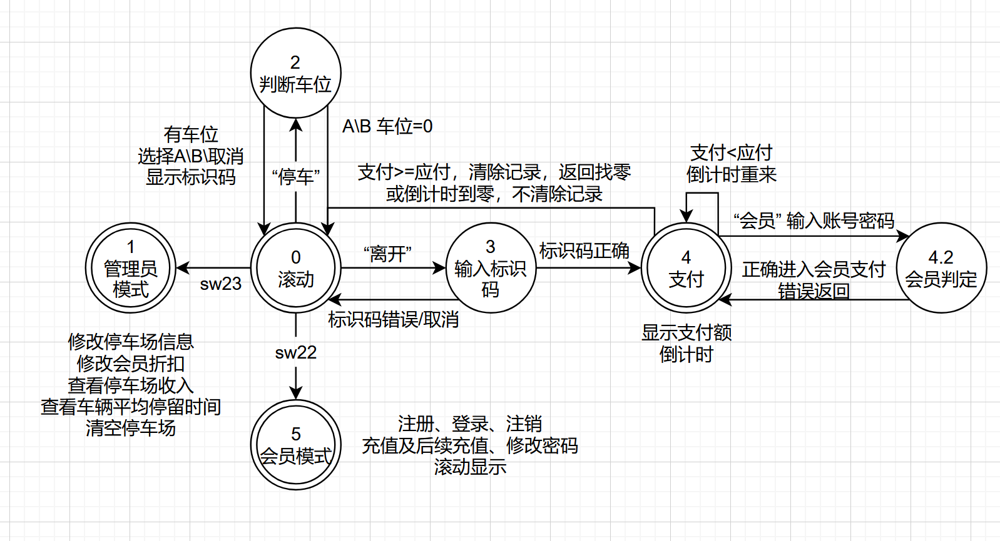

#### 0.1 整体功能描述

本项目利用verilog语言进行开发，借由EDA工具Vivado，在Minisys开发板上实现了一个智能、灵活的停车场系统设计。本停车场系统一共设计了五个主状态，简介如下：

- **状态0：停车场滚动显示主界面**，通过七段数码显示管滚动显示停车场开放车位、剩余车位、起始价、加价额等信息，并可分别切换至A、B停车区显示信息。

- **状态1：管理员模式**，可通过在主界面打开拨码开关[23]进入，拥有最高状态优先级。在管理员模式下，可以实现对A、B停车区开放车位、起始价、加价额等信息的修改，会员支付折扣额度的修改，停车场目前总收入查看、停车场平均停留时间查看、停车场车辆清空等功能。

- **状态2：停车模式**，可通过在主界面点击上按钮进入，可以查看A、B区剩余车位并进行停车，成功停车后将数码显示管将显示停车标识码以供后续支付。当无法进行停车操作时，显示管将显示哭哭表情与用户进行友好互动。

- **状态3：标识码验证模式**，当用户想要驾车离开时，可通过在主界面点击中按钮进入。当标识码输入正确时，将进入支付模式。

- **状态4：支付模式**，进入后开启倒计时（led[1]闪烁，时长大致为1秒钟），当倒计时结束后，将自动退回主界面。支付模式默认为普通支付模式，可通过拨码开关[7:2]进行支付金额调整。此外，可在输入正确账号密码后进入会员支付状态，该状态下须支付金额会根据折扣进行调整，并可直接利用会员充值余额进行支付。若余额不足，仍可通过拨码开关进行费用补充。当支付成功后，停车场将记录收入、停车时间等信息，并将更新车位。

- **状态5：会员模式**，可通过在主界面打开拨码开关[22]进入，可进行会员注册（注册成功将分配会员号，并可存入初始金额）、会员登录操作。会员登录成功后，可以进行后续充值、修改密码、注销等操作，且可以以滚动方式显示会员号及存储金额等信息。

在整个系统运行时，开发板右下角的led[0]将持续进行闪烁，意味着系统计时器的持续计时。此外，本停车场自带圣诞特色背景音乐，可通过拨码开关[21]进行自由播放，为停车场带来了别样的节日色彩。

Main模块的核心代码

```verilog
module main(
    input clk,
    input rst,
    input [23:0] sw,
    input [4:0] bt,
    input [3:0] row,
    output [3:0] col,
    output reg [7:0] seg_out,
    output reg [7:0] seg_en,
    output reg [23:0] led,
    output reg buzzer
);
   //各模块代码省略，将在下面进行详细介绍
    
   //根据所处状态控制七段数码管显示
    always @(posedge clk)begin
        led[0] = led_cnt;
        buzzer = bce_buzzer;
        
        case(view)
            0: begin
                seg_out = bce_seg_out;
     	        seg_en = bce_seg_en;
            end
            1: begin
                seg_out = ad_seg_out;
                seg_en = ad_seg_en; 
            end
            2: begin
            	seg_out = pc_seg_out;
            	seg_en = pc_seg_en;
            end
            3: begin
                seg_out = pn_seg_out;
            	seg_en = pn_seg_en;
            end
            4:begin
                seg_out = seg_outs;
                seg_en = seg_ens;
                led[1] = led_p;
            end
            5:begin
                seg_out = mm_seg_out;
                seg_en = mm_seg_en;
            end
        endcase
     end
    
     //状态转移
     always @(posedge clk)begin
        if(view == 0 && sw[23]) begin
        	view <= 1;
        end else if(view == 1 && ~sw[23])begin
            view <= 0;
        end 
        else if (view == 0 && sw[22]) view <= 5;
        else if (view == 5 && ~sw[22]) view <= 0;
        else begin
            if (view == 0 && bt_link[2]) begin
                view <= 2;
            end else if (view == 2 && bt_link[2]) begin
            	view <= 0;
            end else if (view == 0 && bt_link[3]) begin
            	view <= 3;
          	end else if (view == 3 && bt_link[2]) begin
            	view <= 0;
            end else if (view == 3 && num_correct) begin 
                view <= 4;
            end else if (view == 4) begin
                if (rst || state_s == 15) view <= 0;
            end
        end  
     end
    
endmodule
```

#### 0.2 RTL电路分析图

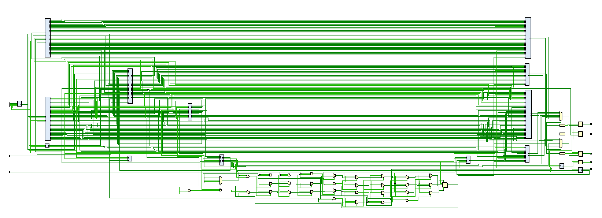

#### 0.3 输入输出设备图

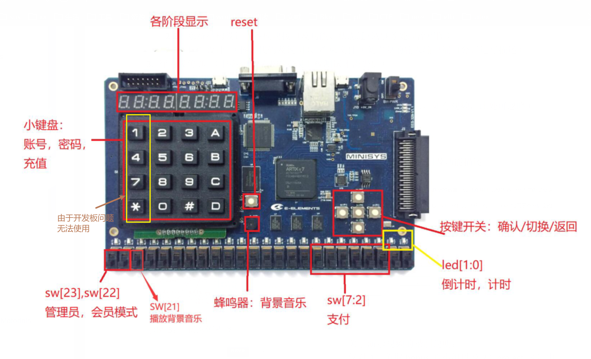

端口规格将在各模块端口信息中进行介绍

**下面将介绍各子模块接口及功能描述**

### 1、滚动显示模块

#### 1.1 系统功能

在滚动状态下，七段数码显示管将滚动显示A或B区停车场的信息，包括：开放车位、剩余车位、计价起始价，每次计数后加价额。

当按下左右按钮时，显示停车区域将会进行切换；另外，当点击小键盘上的 “A” 或 “B” 时，会切换到对应停车区域进行滚动显示。

#### 1.2端口信息

##### 1.2.1 control model

```verilog
module before_car_enter(
    input clk,
    input rst,
    input [4:0] bt_out,
    input [2:0] view,
    output reg [2:0] choose_parking,
    output reg [2:0] state,//内部状态转移
    input [15:0] key_out
    );
```

##### 1.2.2 view model

```verilog
module before_car_enter_display(
    input clk,
    input rst,
    input [2:0] view,
    input [2:0] current, //当前内部状态
    input [2:0] total_a, //A区开放停车数
    input [2:0] total_b, //B区开放停车数
    input [2:0] left_a, //A区剩余车位
    input [2:0] left_b, //B区剩余车位
    input [1:0] price_start_a, //A区起步价
    input [1:0] price_start_b, //B区起步价
    input [1:0] price_add_a, //A区加价
    input [1:0] price_add_b, //B区加价
    output [7:0]  seg_out,
    output [7:0]  seg_en
);
```

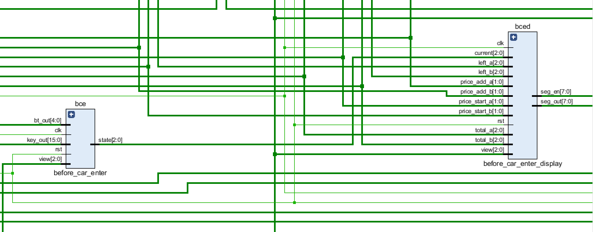

### 2、停车模块 

#### 2.1 系统功能

在滚动状态下，点击上按钮进入停车状态（状态2）

1. 一共设置了A区3个、B区3个，总共6个车位。可以通过管理员模式调整开放的停车位，最多开放3个，最少开放0个。
2. 当所有开放车位均被占满时，七段数码管将显示哭脸 u n u。
3. 若仍有开放车位，则数码管将显示A区B区剩余车位，并通过左右按钮分别选择在A区或B区进行停车。当按下按钮后：
   1. 若对应停车区无车位，数码管将显示哭脸 u n u；
   2. 若对应停车区有车位，则数码管将显示3位停车标识码，标识码由停车区号+车位号组成（例：a02, a20, b22）。同时，对应停车区的车位数将减一。
4. 任何时候，可通过取消键（上按钮）返回滚动状态。
5. 停车成功后，每次led[0]进行闪烁及熄灭时，意味着一次计价增加。
6. 当管理员模块与支付模块中发生对停车场信息的调整时，会经由该模块进行变量的重新赋值。

#### 2.2 端口信息

```verilog
module park_car_view (
    input clk,
    input rst,
    input [2:0] view,
    input [4:0] bt,

    input [2:0] open_a,
    input [2:0] open_b,
    input [8:0] count, //主计时器
    input [2:0] leave_car, //支付成功后离开的车辆标识码

    output reg [2:0] left_a,
    output reg [2:0] left_b,
    output reg [5:0] a_pos, //A区停车情况
    output reg [5:0] b_pos, //B区停车情况

    output reg [8:0] a1_count, //A区车位1停入时的计时，下同
    output reg [8:0] a2_count,
    output reg [8:0] a3_count,
    output reg [8:0] b1_count,
    output reg [8:0] b2_count,
    output reg [8:0] b3_count,

    output [7:0] seg_out,
    output [7:0] seg_en,

    input a_clean, //从管理员模块中传入的清空信号
    input b_clean
);
```

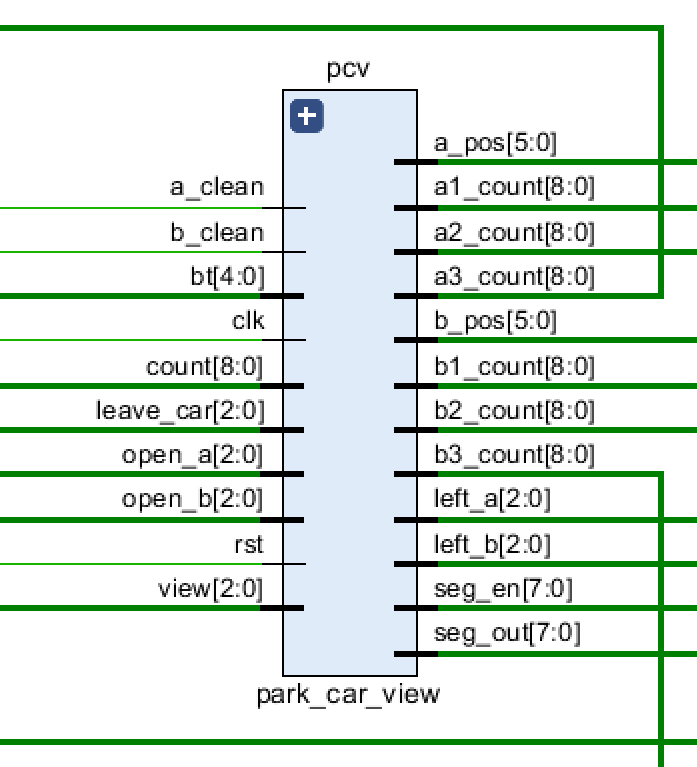

### 3、标识码验证模块

#### 3.1 系统功能

在滚动状态下，点击中按钮进入标识码验证状态

1. 标识码总共可输入0 - 3位，第一位只能是代表停车区号的A或B，第二、三位可以是任意数字。输入结束后，按下中按钮进行标识码匹配。
2. 当输入标识码不存在时，数码管将显示哭脸 u n u。可再次按压中按钮重新输入。
3. 当输入标识码存在时，将进入状态4：支付模式。
4. 任何时候，可通过上按钮返回滚动状态。

#### 3.2 端口信息

```verilog
module park_num_check (
    input rst,
    input clk,
    input[15:0] key,
    input [4:0] bt,

    input [2:0] view,
    input [5:0] a_pos,
    input [5:0] b_pos,

    output reg num_correct, //标识码是否输入正确
    output reg [2:0] num, //进入支付状态车辆标识码
    output [7:0] seg_out,
    output [7:0] seg_en
);
```

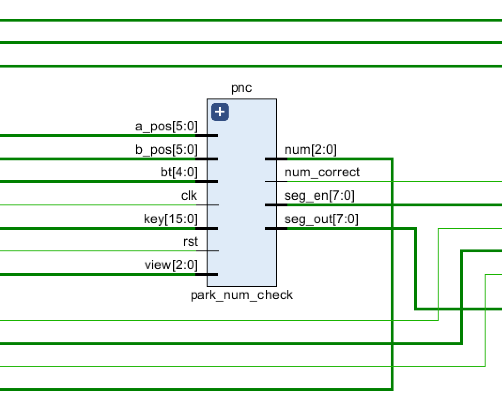

### 4、支付模块

#### 4.1 系统功能

1. 普通支付模式：进入支付模式后显示停车时长和费用，拨码开关[7:2]对应支付的钱数，按中键支付
   1. 若所付钱数足够，数码管将显示“done”字样，再次按下中键，将返回滚动状态。同时，停车场总利润将记录费用收入，停车场车位将更新。
   2. 若所付钱数不足，数码管将显示“fail”字样，按下中键后并返回支付界面，倒计时清零。
   3. 若倒计时结束（60次计时），数码管将显示“fail”字样，按下中键后返回滚动状态。

2. 会员支付：按左键或右键进入登录界面，显示log in，按中键确认。
   1. 小键盘输入会员号，中键确认，若不存在此会员显示error，中键返回时长费用界面。
   2. 小键盘输入密码，中间确认，若密码错误显示error，中键返回时长费用界面。
   3. 若登录成功，显示折扣费用和会员余额，按中键支付。
      1. 若余额充足，则显示支付后的余额，中键返回默认界面。
      2. 若余额不足，则显示扣除余额后仍需支付的费用，用拨码开关表示钱数，中键支付。
         1. 若补钱充足，显示找零，中键返回默认界面；
         2. 若补钱不足，显示fail，返回上个界面。
      3. 若成功支付，会员余额相应减少，停车场总利润加上折扣后的费用收入，车位更新。
      4. 若倒计时耗尽，返回主界面，车不会被移出。

#### 4.2 端口信息

##### 4.2.1 control model

```verilog
module pay (
    input clk,
    input rst,
    input [2:0] view,//view=3为支付模式
    output reg [4:0] state,//子模块的状态
    input [23:0] sw,//拨码开关
    output reg led,//led[1],随倒计时闪烁
    input [15:0] key_out,//小键盘
    input [4:0] bt_out,//按键开关
    input [14:0] s,//记录该会员号是否存在;
    input [21:0] one,//存储1号会员的密码，和余额;
    input [21:0] two,
    input [21:0] three,
    input [21:0] four,
    input [21:0] five,
    output reg [3:0] account,//当前登录会员号
    output reg [15:0] psword,//会员登录输入的密码
    output reg [2:0] cnt_psword,//会员登录输入的密码的位数
    output reg [1:0] ps_error_time,//错误位数，无论输入几位，只要错误就会提示"error";
    output reg isM,//是否输入会员号
    input [2:0] num,//标识码
    output reg [2:0] the_car,//支付成功滚蛋的车 
    input [8:0] main_count,//背景时间
    input [8:0] a1_count,//a1停车的时间
    input [8:0] a2_count,
    input [8:0] a3_count,
    input [8:0] b1_count,
    input [8:0] b2_count,
    input [8:0] b3_count,
    input [1:0] start_a,//a起步价
    input [1:0] start_b,//b起步价
    input [1:0] each_a,//a单价
    input [1:0] each_b,//b单价
    output reg [8:0] fee,//费用
    output reg [8:0] ch4nge,//找零
    output reg [8:0] fee_mem,//打完折的费用
    input [3:0] discount,//折扣
    output reg [8:0] rest,//会员余额
    output reg [8:0] change_mem,//支付后的余额
    output reg [8:0] change_m2m,//余额不足时补钱的找零
    output reg [8:0] fee_r,//余额不足时需要补的钱
    output reg [8:0] count,//需要结算的count，会随时间变化增加
    output reg is_money_change,//传给会员模式，改余额
    output reg [8:0] profit,//总利润
    input is_clean_profit,//是否清空利润
    output reg [8:0] time_avg
);
```

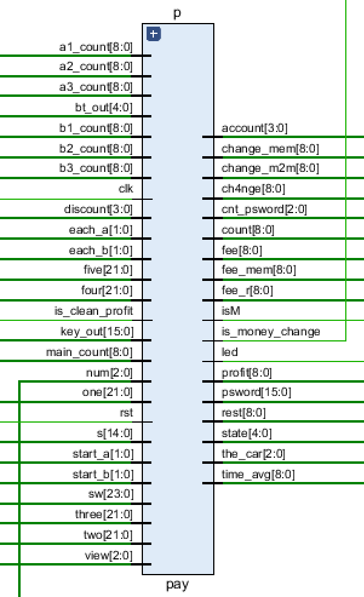

##### 4.2.2 display model

```verilog
module pay_display (
    input clk,
    input rst,
    input [2:0] view ,
    input [4:0] state,
    output [7:0] seg_out,
    output [7:0] seg_en,
    input [3:0] account,
    input [15:0] psword,
    input [2:0] cnt_psword,
    input isM,
    input [8:0]count,
    input [8:0]fee,
    input [8:0]ch4nge,
    input [8:0]fee_mem,
    input [8:0]rest,
    input [8:0]change_mem,
    input [8:0]change_m2m,
    input [8:0]fee_r
);
```

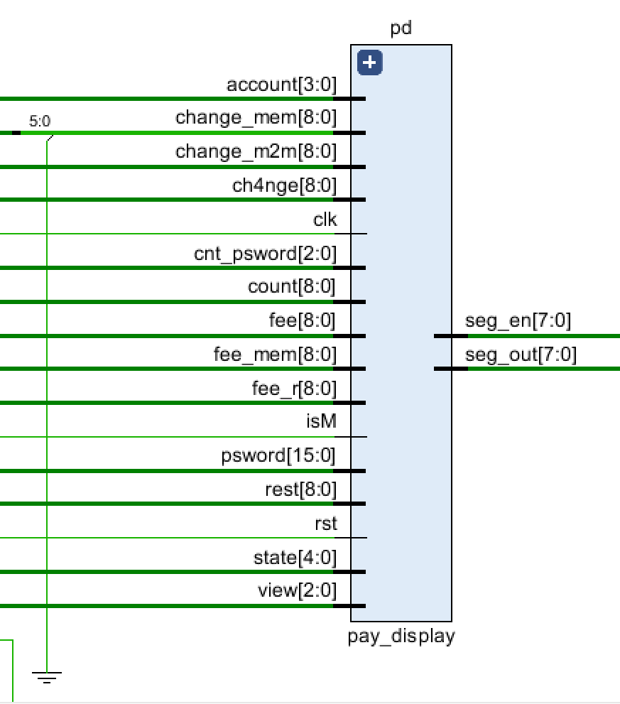

### 5、会员模块

#### 5.1 系统功能

实现优化会员系统，分为两个方面：

1. 注册会员，系统会分配会员号，格式为"S1", "S2"等等，不超过"S5"。
   1. 如果超过五个会员，系统会提示已经满了，无法进行注册。
   2. 成功分配会员号以后，需要输入4位密码，以及输入要存入的金额（不超过50元），并且系统会提示注册成功。
2. 登录会员，会员登录需要输入自己对应的会员号，范围是1-5
   1. 如果该会员号不存在，就会提示"error" 
   2. 如果会员号存在，会进入输入密码界面，要输入4位之前注册的时候输入的密码，如果输入密码不正确，将提示"error"，并且无法进入登录以后的界面。
3. 成功输入密码以后，进入会员界面，其中有三个功能"1b 2t 3c"
   1. 其中"b"表示注销，"t"表示后续充值，"c"表示修改密码，因为Minisys开发板的问题小键盘第一列无法使用于是"1,2,3"分别对应"2,3,A"。
   2. 如果注销账户，系统会提示你已经注销，将无法再次用此账户登录，如果充值，在50元范围内都能成功充值，如果超过50元，将会退还给用户超过的钱，如果修改密码，下一次登录的时候将使用新的密码才能登录。
4. 支持信息滚动，可以在成功登录会员之后切换至滚动状态，滚动信息分别为会员号及存储的金额。

#### 5.2 端口信息

##### **5.2.1 control model**

```verilog
module member_model(
    input clk,
    input rst,
    input [4:0] bt_out,
    input [2:0] view,
    output reg [14:0] s,//记录该会员号是否存在;
    output reg [21:0] one,//存储1号会员的密码，和余额;
    output reg [21:0] two,//存储2号会员的密码，和余额;
    output reg [21:0] three,//存储3号会员的密码，和余额;
    output reg [21:0] four,//存储4号会员的密码，和余额;
    output reg [21:0] five,//存储5号会员的密码，和余额;
    output reg [3:0] account,//当前登录的会员账户;
    output reg [15:0] psword,//会员登录时输入的密码;
    output reg [2:0] cnt_psword,//会员登录输入的密码的位数;
    output reg [1:0] ps_error_time, //错误位数，无论输入几位，只要错误就会提示"error";
    output reg [15:0] becomeMemPsword,//成为会员时输入的密码;
    output reg [2:0] cnt_ch_psword,//成为会员记录输入密码位数;
    output reg [2:0] be_account,//分发的会员号;
    output reg [1:0] select_op,//会员选择的操作, 即"1b 2t 3c";
    output reg isCancel, isChoosed,//是否注销
    //刚注册的充钱
    output reg [5:0] be_money, //总数
    output reg [1:0] cnt_be_money, //计数器
    output reg [2:0] be_money_ten, //十位数    
    output reg [3:0] be_money_one, //个位数
    //会员后续充钱
    output reg [5:0] money, //总数
    output reg [1:0] cnt_money, //计数器
    output reg [2:0] money_ten, //十位数    
    output reg [3:0] money_one, //个位数
    output reg [5:0] le_money, //退还的钱钱
    output reg [15:0] now_ps,//会员修改密码时，记录修改之后的密码;
    output reg [2:0] cnt_ps,//记录会员修改密码，记录输入的位数
    output reg [4:0] state,//当前子模块里面的状态;
    input [15:0] key_out,//用到小键盘;
    output reg isM,//是否输入会员号;
    input is_money_change,
    input [5:0] change_pay,
    input [3:0] account_pay
);
```

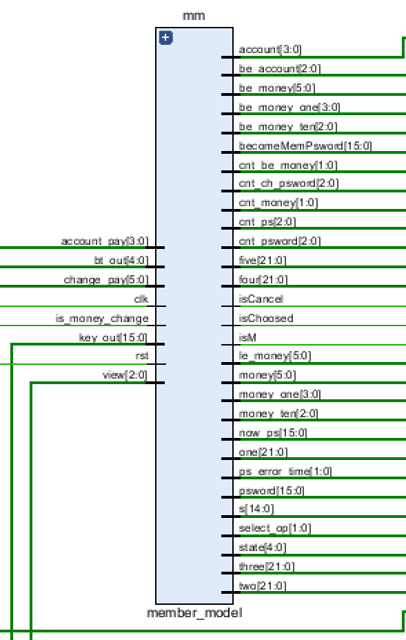

##### **5.2.2 display model**

```verilog
module member_model_display(
    input clk,
    input rst,
    input [2:0] view,//由main方法传入子模块，当前为会员模式显示界面;
    input [4:0] state,//当前子模块里面的状态，每个状态显示界面;
    input [3:0] account,//当前登录会员号
    input [15:0] psword,//会员登录输入的密码
    input [2:0] cnt_psword,//会员登录输入的密码的位数
    input [1:0] ps_error_time, //错误位数，无论输入几位，只要错误就会提示"error";
    input [15:0] becomeMemPsword,//成为会员时输入的密码;
    input [2:0] cnt_ch_psword,//成为会员时记录输入密码位数; 
    input [2:0] be_account,//分发的会员号;
    input [1:0] select_op,//会员选择的操作, 即"1b 2t 3c";
    input isCancel, isChoosed,//是否注销
    //刚注册的充钱
    input [5:0] be_money, //总数
    input [1:0] cnt_be_money, //计数器
    input [2:0] be_money_ten, //十位数    
    input [3:0] be_money_one, //个位数
    //会员重新充钱
    input [5:0] money, //总数
    input [1:0] cnt_money, //计数器
    input [2:0] money_ten, //十位数    
    input [3:0] money_one, //个位数
    input [5:0] le_money, //退还的钱钱
    input [15:0] now_ps, //会员修改之后的密码
    input [2:0] cnt_ps, //修改密码的位数
    //用七段数码管显示
    output [7:0] seg_out,
    output [7:0] seg_en,
    input isM, //是否输入会员号;
    input  [21:0] one, 
    input [21:0] two,    
    input [21:0] three,   
    input [21:0] four,    
    input [21:0] five    
);
```

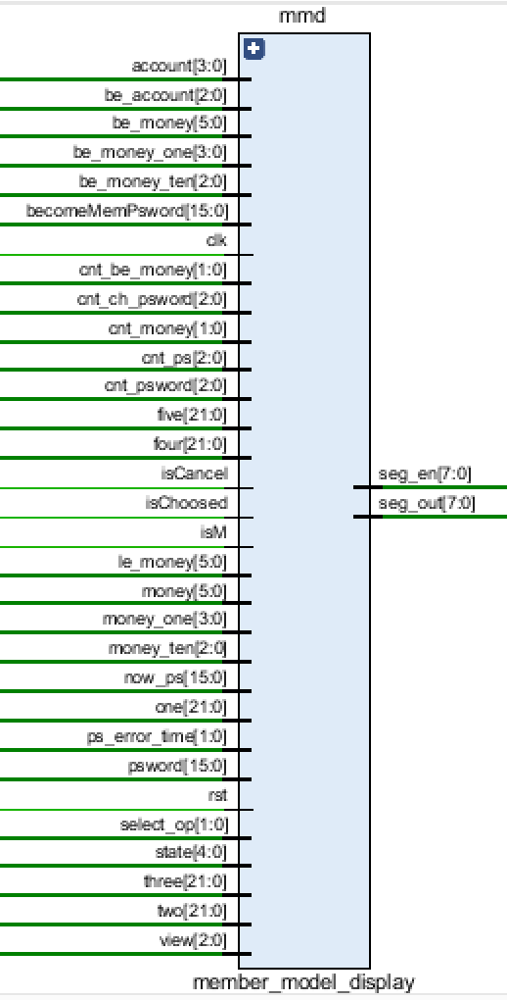

### 6、管理员模块

#### 6.1 系统功能

实现管理员系统：

1. 首先需要通过密码登录，密码由内部设置，输入错误将无法登录管理员模式，并显示"error"。
2. 登录以后会出现一个功能显示界面，显示的内容为"2r3bAC5d"，"r"表示修改A、B区的起始价格，后续的加价，停车场开放的车位，以及会员的折扣；"b"表示查看停车场目前的总收入，以及提供清空功能（不分A、B区）；"C"表示显示车辆的平均停留时间；"d"表示清空A、B区的剩余车辆数。
3. 其中，进入"r"，显示界面为"ASE Ecdd"，其中按"A"，进入"SE" 可以修改A、B区的起始价格，后续的加价；按"E"可以对A、B区开放的车位，按"d"可以设置会员的折扣价。部分修改结果将会直接在滚动显示中体现。

#### 6.2 端口信息

##### 6.2.1 control model

```verilog
module administrator_model(
    input clk,
    input rst,
    input [2:0] view, //由main方法传入子模块，当前为会员模式显示界面;
    output reg [4:0] state, //当前子模块里面的状态，每个状态显示界面;
    output reg [3:0] discount, //会员折扣价
    output reg [2:0] open_a,//A区开放的车位
    output reg [2:0] open_b,//B区开放的车位
    output reg a_clean,//A区是否清零
    output reg b_clean,//B区是否清零
    output reg [8:0] profit,//停车场总收入
    output reg [5:0] a_pos,//记录A区是否停车
    output reg [5:0] b_pos,//记录B区是否停车
    output reg [1:0] start_a,//A区起步价
    output reg [1:0] start_b,//B区起步价
    output reg [1:0] each_a,//A区加价
    output reg [1:0] each_b,//B区加价
    output reg[19:0] ps_write,//输入密码
    output reg [2:0] cnt_ps,//输入密码的位数
    output reg [2:0] ps_error_time,//输入密码错误(位数、内容)，无论输入几位，只要错误就会提示"error";
    output reg [3:0] select1,//记录第一个选择界面的选择结果;
    output reg [3:0] select2,//记录第二个选择界面的选择结果;
    output reg [2:0] select3,//记录第三个选择界面的选择结果;
    output reg cnt_starta,//输入A区起步价的位数
    output reg [1:0]show_starta,//输入的A区的值
    output reg cnt_startb,//输入B区起步价的位数
    output reg [1:0]show_startb,//输入B区的值
    output reg cnt_eacha,//输入A区加价的位数
    output reg [1:0]show_eacha, //输入A区加价的值
    output reg cnt_eachb,//输入B区加价的位数
    output reg [1:0]show_eachb, //输入B区加价的值
    output reg cnt_toa,//输入A区开放车位的位数
    output reg [2:0]show_toa,//输入A区开放车位数   
    output reg cnt_tob,//输入B区开放车位的位数
    output reg [2:0]show_tob,//输入B区开放车位数   
    output reg cnt_dis,//会员折扣输入位数
    output reg [3:0] show_dis,//输入会员折扣
    input [15:0] key_out,
    input [4:0] bt
);
```

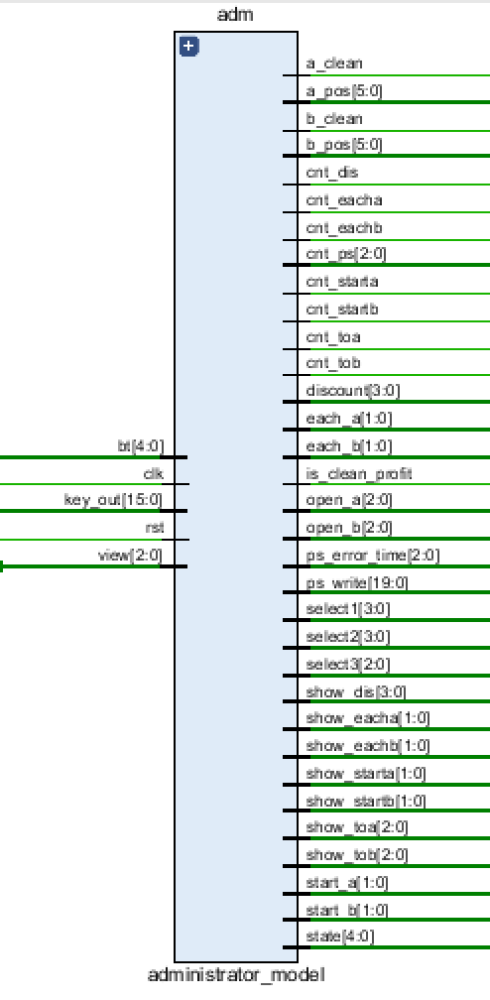

##### 6.2.2 display model

```verilog
 module administrator_model_display(
     input clk,
     input rst,
     input [2:0] view,//由main方法传入子模块，当前为会员模式显示界面;
     input [4:0] state,//当前子模块里面的状态，每个状态显示界面;
     input [3:0] discount,//会员折扣价
     input [2:0] open_a,//A区开放的车位
     input [2:0] open_b,//B区开放的车位
     input [2:0] left_a,//A区剩余车位
     input [2:0] left_b,//B区剩余车位
     input [8:0] profit,//停车场总收益
     input [5:0] a_pos,//A区是否停车
     input [5:0] b_pos,//B区是否停车
     input [1:0] start_a,//A区起始价
     input [1:0] start_b,//B区起始价
     input [1:0] each_a,//A区加价
     input [1:0] each_b,//B区加价
     input [19:0] ps_write,//输入密码 
     input [2:0] cnt_ps,//输入密码的位数
     input [2:0] ps_error_time,//输入密码错误(位数、内容)，无论输入几位，只要错误就会提示"error";
     input [3:0] select1,//记录第一个选择界面的选择结果;
     input [3:0] select2,//记录第二个选择界面的选择结果;
     input [2:0] select3,//记录第三个选择界面的选择结果;
     input cnt_starta,//输入A区起步价的位数
     input [1:0] show_starta,//输入的A区的值
     input cnt_startb,//输入B区起步价的位数
     input [1:0] show_startb,//输入的B区的值
     input cnt_eacha,//输入A区加价的位数
     input [1:0] show_eacha, //输入A区加价的值
     input cnt_eachb,//输入B区加价的位数
     input [1:0] show_eachb, //输入B区加价的值
     input cnt_toa,//输入A区开放车位的位数
     input [2:0]show_toa,//输入A区开放车位数
     input cnt_tob,//输入B区开放车位的位数
     input [2:0] show_tob,//输入B区开放车位数
     input cnt_dis,//折扣的位数
     input [3:0] show_dis,//改变后的折扣数
     output [7:0] seg_out,
     output [7:0] seg_en,
     input [8:0] time_avg
    );
```

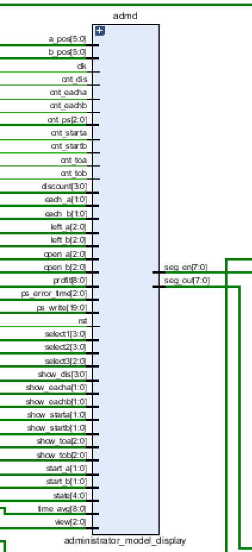

### 7、其他模块

#### 7.1 计数器模块

系统主计数器，为停留车辆进行计价加费。

```verilog
module the_counter (
    input clk,
    input rst,
    output reg [8:0] count,
    output reg led
);
```

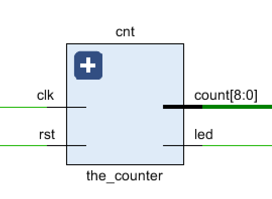

#### 7.2 背景音乐模块

与sw[21]绑定，进行圣诞背景音乐的播放。

```verilog
module music_player(
    input clk,
    input rst,
    input sw,
    output buzzer
);
```

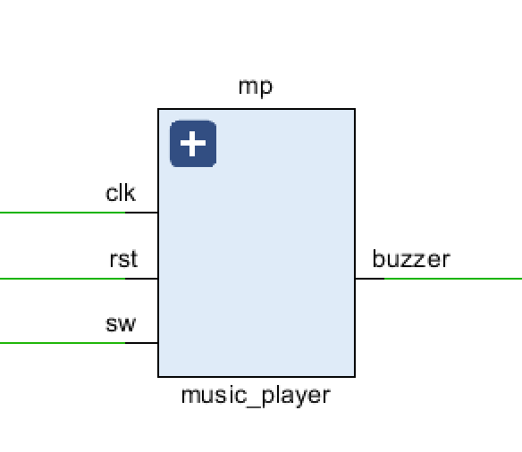

### 8、约束文件

```verilog
set_property PACKAGE_PIN K17 [get_ports {led[23]}]
set_property PACKAGE_PIN L13 [get_ports {led[22]}]
set_property PACKAGE_PIN M13 [get_ports {led[21]}]
set_property PACKAGE_PIN K14 [get_ports {led[20]}]
set_property PACKAGE_PIN K13 [get_ports {led[19]}]
set_property PACKAGE_PIN M20 [get_ports {led[18]}]
set_property PACKAGE_PIN N20 [get_ports {led[17]}]
set_property PACKAGE_PIN N19 [get_ports {led[16]}]
set_property PACKAGE_PIN M17 [get_ports {led[15]}]
set_property PACKAGE_PIN M16 [get_ports {led[14]}]
set_property PACKAGE_PIN M15 [get_ports {led[13]}]
set_property PACKAGE_PIN K16 [get_ports {led[12]}]
set_property PACKAGE_PIN L16 [get_ports {led[11]}]
set_property PACKAGE_PIN L15 [get_ports {led[10]}]
set_property PACKAGE_PIN L14 [get_ports {led[9]}]
set_property PACKAGE_PIN J17 [get_ports {led[8]}]
set_property PACKAGE_PIN F21 [get_ports {led[7]}]
set_property PACKAGE_PIN G22 [get_ports {led[6]}]
set_property PACKAGE_PIN G21 [get_ports {led[5]}]
set_property PACKAGE_PIN D21 [get_ports {led[4]}]
set_property PACKAGE_PIN E21 [get_ports {led[3]}]
set_property PACKAGE_PIN D22 [get_ports {led[2]}]
set_property PACKAGE_PIN E22 [get_ports {led[1]}]
set_property PACKAGE_PIN A21 [get_ports {led[0]}]
set_property IOSTANDARD LVCMOS33 [get_ports {led[23]}]
set_property IOSTANDARD LVCMOS33 [get_ports {led[22]}]
set_property IOSTANDARD LVCMOS33 [get_ports {led[21]}]
set_property IOSTANDARD LVCMOS33 [get_ports {led[20]}]
set_property IOSTANDARD LVCMOS33 [get_ports {led[19]}]
set_property IOSTANDARD LVCMOS33 [get_ports {led[18]}]
set_property IOSTANDARD LVCMOS33 [get_ports {led[17]}]
set_property IOSTANDARD LVCMOS33 [get_ports {led[16]}]
set_property IOSTANDARD LVCMOS33 [get_ports {led[15]}]
set_property IOSTANDARD LVCMOS33 [get_ports {led[14]}]
set_property IOSTANDARD LVCMOS33 [get_ports {led[13]}]
set_property IOSTANDARD LVCMOS33 [get_ports {led[12]}]
set_property IOSTANDARD LVCMOS33 [get_ports {led[11]}]
set_property IOSTANDARD LVCMOS33 [get_ports {led[10]}]
set_property IOSTANDARD LVCMOS33 [get_ports {led[9]}]
set_property IOSTANDARD LVCMOS33 [get_ports {led[8]}]
set_property IOSTANDARD LVCMOS33 [get_ports {led[7]}]
set_property IOSTANDARD LVCMOS33 [get_ports {led[6]}]
set_property IOSTANDARD LVCMOS33 [get_ports {led[5]}]
set_property IOSTANDARD LVCMOS33 [get_ports {led[4]}]
set_property IOSTANDARD LVCMOS33 [get_ports {led[3]}]
set_property IOSTANDARD LVCMOS33 [get_ports {led[2]}]
set_property IOSTANDARD LVCMOS33 [get_ports {led[1]}]
set_property IOSTANDARD LVCMOS33 [get_ports {led[0]}]
set_property PACKAGE_PIN Y9 [get_ports {sw[23]}]
set_property PACKAGE_PIN W9 [get_ports {sw[22]}]
set_property PACKAGE_PIN Y7 [get_ports {sw[21]}]
set_property PACKAGE_PIN Y8 [get_ports {sw[20]}]
set_property PACKAGE_PIN AB8 [get_ports {sw[19]}]
set_property PACKAGE_PIN AA8 [get_ports {sw[18]}]
set_property PACKAGE_PIN V8 [get_ports {sw[17]}]
set_property PACKAGE_PIN V9 [get_ports {sw[16]}]
set_property PACKAGE_PIN AB6 [get_ports {sw[15]}]
set_property PACKAGE_PIN AB7 [get_ports {sw[14]}]
set_property PACKAGE_PIN V7 [get_ports {sw[13]}]
set_property PACKAGE_PIN AA6 [get_ports {sw[12]}]
set_property PACKAGE_PIN Y6 [get_ports {sw[11]}]
set_property PACKAGE_PIN T6 [get_ports {sw[10]}]
set_property PACKAGE_PIN R6 [get_ports {sw[9]}]
set_property PACKAGE_PIN V5 [get_ports {sw[8]}]
set_property PACKAGE_PIN U6 [get_ports {sw[7]}]
set_property PACKAGE_PIN W5 [get_ports {sw[6]}]
set_property PACKAGE_PIN W6 [get_ports {sw[5]}]
set_property PACKAGE_PIN U5 [get_ports {sw[4]}]
set_property PACKAGE_PIN T5 [get_ports {sw[3]}]
set_property PACKAGE_PIN T4 [get_ports {sw[2]}]
set_property PACKAGE_PIN R4 [get_ports {sw[1]}]
set_property PACKAGE_PIN W4 [get_ports {sw[0]}]
set_property IOSTANDARD LVCMOS33 [get_ports {sw[23]}]
set_property IOSTANDARD LVCMOS33 [get_ports {sw[22]}]
set_property IOSTANDARD LVCMOS33 [get_ports {sw[21]}]
set_property IOSTANDARD LVCMOS33 [get_ports {sw[20]}]
set_property IOSTANDARD LVCMOS33 [get_ports {sw[19]}]
set_property IOSTANDARD LVCMOS33 [get_ports {sw[18]}]
set_property IOSTANDARD LVCMOS33 [get_ports {sw[17]}]
set_property IOSTANDARD LVCMOS33 [get_ports {sw[16]}]
set_property IOSTANDARD LVCMOS33 [get_ports {sw[15]}]
set_property IOSTANDARD LVCMOS33 [get_ports {sw[14]}]
set_property IOSTANDARD LVCMOS33 [get_ports {sw[13]}]
set_property IOSTANDARD LVCMOS33 [get_ports {sw[12]}]
set_property IOSTANDARD LVCMOS33 [get_ports {sw[11]}]
set_property IOSTANDARD LVCMOS33 [get_ports {sw[10]}]
set_property IOSTANDARD LVCMOS33 [get_ports {sw[9]}]
set_property IOSTANDARD LVCMOS33 [get_ports {sw[8]}]
set_property IOSTANDARD LVCMOS33 [get_ports {sw[7]}]
set_property IOSTANDARD LVCMOS33 [get_ports {sw[6]}]
set_property IOSTANDARD LVCMOS33 [get_ports {sw[5]}]
set_property IOSTANDARD LVCMOS33 [get_ports {sw[4]}]
set_property IOSTANDARD LVCMOS33 [get_ports {sw[3]}]
set_property IOSTANDARD LVCMOS33 [get_ports {sw[2]}]
set_property IOSTANDARD LVCMOS33 [get_ports {sw[1]}]
set_property IOSTANDARD LVCMOS33 [get_ports {sw[0]}]

set_property PACKAGE_PIN Y18 [get_ports {clk}]
set_property IOSTANDARD LVCMOS33 [get_ports {clk}]

set_property PACKAGE_PIN P20 [get_ports {rst}]
set_property IOSTANDARD LVCMOS33 [get_ports {rst}]

set_property PACKAGE_PIN P2 [get_ports {bt[4]}]
set_property PACKAGE_PIN P4 [get_ports {bt[3]}]
set_property PACKAGE_PIN P5 [get_ports {bt[2]}]
set_property PACKAGE_PIN P1 [get_ports {bt[1]}]
set_property PACKAGE_PIN R1 [get_ports {bt[0]}]
set_property IOSTANDARD LVCMOS15 [get_ports {bt[4]}]
set_property IOSTANDARD LVCMOS15 [get_ports {bt[3]}]
set_property IOSTANDARD LVCMOS15 [get_ports {bt[2]}]
set_property IOSTANDARD LVCMOS15 [get_ports {bt[1]}]
set_property IOSTANDARD LVCMOS15 [get_ports {bt[0]}]

set_property IOSTANDARD LVCMOS33 [get_ports {seg_en[0]}]
set_property IOSTANDARD LVCMOS33 [get_ports {seg_en[1]}]
set_property IOSTANDARD LVCMOS33 [get_ports {seg_en[2]}]
set_property IOSTANDARD LVCMOS33 [get_ports {seg_en[3]}]
set_property IOSTANDARD LVCMOS33 [get_ports {seg_en[4]}]
set_property IOSTANDARD LVCMOS33 [get_ports {seg_en[5]}]
set_property IOSTANDARD LVCMOS33 [get_ports {seg_en[6]}]
set_property IOSTANDARD LVCMOS33 [get_ports {seg_en[7]}]
set_property IOSTANDARD LVCMOS33 [get_ports {seg_out[0]}]
set_property IOSTANDARD LVCMOS33 [get_ports {seg_out[1]}]
set_property IOSTANDARD LVCMOS33 [get_ports {seg_out[2]}]
set_property IOSTANDARD LVCMOS33 [get_ports {seg_out[3]}]
set_property IOSTANDARD LVCMOS33 [get_ports {seg_out[4]}]
set_property IOSTANDARD LVCMOS33 [get_ports {seg_out[5]}]
set_property IOSTANDARD LVCMOS33 [get_ports {seg_out[6]}]
set_property IOSTANDARD LVCMOS33 [get_ports {seg_out[7]}]
set_property PACKAGE_PIN A18 [get_ports {seg_en[7]}]
set_property PACKAGE_PIN A20 [get_ports {seg_en[6]}]
set_property PACKAGE_PIN B20 [get_ports {seg_en[5]}]
set_property PACKAGE_PIN E18 [get_ports {seg_en[4]}]
set_property PACKAGE_PIN F18 [get_ports {seg_en[3]}]
set_property PACKAGE_PIN D19 [get_ports {seg_en[2]}]
set_property PACKAGE_PIN E19 [get_ports {seg_en[1]}]
set_property PACKAGE_PIN C19 [get_ports {seg_en[0]}]
set_property PACKAGE_PIN E13 [get_ports {seg_out[7]}]
set_property PACKAGE_PIN C15 [get_ports {seg_out[6]}]
set_property PACKAGE_PIN C14 [get_ports {seg_out[5]}]
set_property PACKAGE_PIN E17 [get_ports {seg_out[4]}]
set_property PACKAGE_PIN F16 [get_ports {seg_out[3]}]
set_property PACKAGE_PIN F14 [get_ports {seg_out[2]}]
set_property PACKAGE_PIN F13 [get_ports {seg_out[1]}]
set_property PACKAGE_PIN F15 [get_ports {seg_out[0]}]

set_property PACKAGE_PIN A19 [get_ports {buzzer}]
set_property IOSTANDARD LVCMOS33 [get_ports {buzzer}]

set_property PACKAGE_PIN K4 [get_ports {row[3]}]
set_property PACKAGE_PIN J4 [get_ports {row[2]}]
set_property PACKAGE_PIN L3 [get_ports {row[1]}]
set_property PACKAGE_PIN K3 [get_ports {row[0]}]
set_property PACKAGE_PIN M2 [get_ports {col[3]}]
set_property PACKAGE_PIN K6 [get_ports {col[2]}]
set_property PACKAGE_PIN J6 [get_ports {col[1]}]
set_property PACKAGE_PIN L5 [get_ports {col[0]}]
set_property IOSTANDARD LVCMOS15 [get_ports {row[0]}]
set_property IOSTANDARD LVCMOS15 [get_ports {row[1]}]
set_property IOSTANDARD LVCMOS15 [get_ports {row[2]}]
set_property IOSTANDARD LVCMOS15 [get_ports {row[3]}]
set_property IOSTANDARD LVCMOS15 [get_ports {col[0]}]
set_property IOSTANDARD LVCMOS15 [get_ports {col[1]}]
set_property IOSTANDARD LVCMOS15 [get_ports {col[2]}]
set_property IOSTANDARD LVCMOS15 [get_ports {col[3]}]
```

## 三、总结及优化

#### 1、当前系统特色

本系统基本实现了项目要求功能，以简洁自然的用户交互设计、优秀的滚动显示界面、强大的管理员及会员系统、富有趣味的数码管显像、美妙的圣诞背景音乐为特色，致力于为用户打造一个舒适、舒心的停车系统。

#### 2、遇到的问题及解决办法

①我们的Minisys开发板小键盘上的1、4、7、*列无法使用，这为我们的信息输入及判断增添了许多麻烦。为了避免输入相应数字，我们让产生的数值尽量避免了1、4、7，例如当出现1时，我们通过判断条件将其设置为2，以便后续与输入的小键盘信息进行对应。

②我们在初次设计模块时，犯了在同一个模块中的不同always块里对同一个变量进行赋值的错误，从而出现了许多奇怪的问题，再经历了艰难的debug过程后终于发现了问题并进行修正。

③当我们在写好不同模块后进行串联时，由于交流不充分使得main模块中的一些wire变量在不同的模块中同时进行了赋值，从而出现了multiple-driver的错误，在发现问题后通过将赋值操作统一在一个模块中进行了修正。

④当我们试图在某个模块中修改main模块中定义的某个变量值时，我们遇到了“是否需要将该变量同时作为input又作为output”的困惑。后来，我们发现可以将该变量的初值定义及后续赋值改变都写在具体模块的always块中，仅仅将该变量作为具体模块的`output reg`与main模块中的wire相连即可。

#### 3、优化及展望

①可以实现在不同的状态界面下播放不同的背景音乐；

②可以尝试使用vga接口将停车场系统形象化；

③可以尝试扩大停车场数据规模，并将所有的显示替换为滚动显示；

④可以尝试利用开发板的麦克风接口，并进行对应操作。
